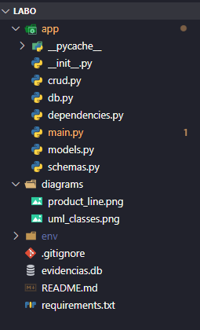
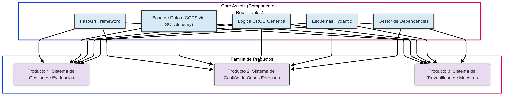
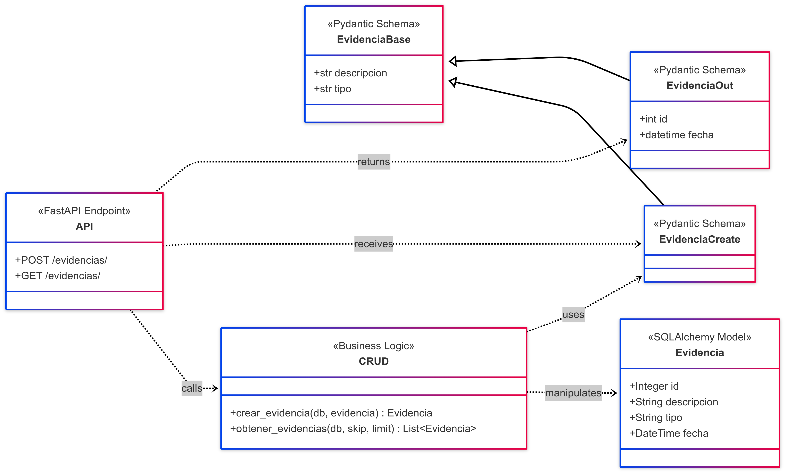

# Laboratorio: Reutilización de Software con FastAPI y COTS

## 1. Propósito del Laboratorio: ¿Qué se buscó resolver?

El principal problema que se abordó en este laboratorio fue cómo **optimizar el proceso de desarrollo de software** para hacerlo más rápido, económico y fiable. En la industria, construir cada aplicación desde cero es ineficiente y propenso a errores. Por lo tanto, el objetivo central fue explorar y aplicar de manera práctica los principios de la **reutilización de software**.

Se buscó demostrar que, al emplear componentes, arquitecturas y productos ya existentes y probados, es posible construir sistemas complejos de alta calidad en una fracción del tiempo. El caso práctico fue el desarrollo de un **API para un Sistema de Gestión de Evidencias Forenses**.

## 2. Objetivos Específicos

De acuerdo con la guía del laboratorio, los objetivos específicos a cumplir fueron:

* **Comprender y aplicar la reutilización de software:** Analizar sus beneficios y desafíos en un contexto práctico.
* **Utilizar un framework de aplicación:** Emplear FastAPI para crear una aplicación modular con componentes reutilizables.
* **Diseñar una línea de productos:** Modelar cómo un conjunto de componentes base puede dar lugar a una familia de sistemas relacionados.
* **Integrar un producto COTS (Commercial-Off-The-Shelf):** Incorporar una solución de terceros (SQLite a través de SQLAlchemy) para acelerar el desarrollo y garantizar la fiabilidad de la persistencia de datos.

## 3. Arquitectura y Estructura del Proyecto

Para alcanzar los objetivos, se diseñó una arquitectura modular y desacoplada. La estructura de archivos implementada fue la siguiente, la cual separa claramente las responsabilidades de cada componente, facilitando así su reutilización:


## 4. Diagramas de Arquitectura y Diseño

Los siguientes diagramas visualizan la arquitectura y los conceptos de reutilización aplicados.

### 4.1. Diagrama de Línea de Productos

**Explicación:** Este diagrama es la representación visual más importante del concepto de reutilización. Muestra cómo un conjunto de **"Core Assets"** (activos centrales y reutilizables) como el framework, la base de datos, la lógica CRUD y los esquemas, forman una base sólida. A partir de esta base, se puede generar una **"Familia de Productos"** de manera eficiente. En lugar de construir cada sistema desde cero, simplemente se ensamblan y personalizan los componentes centrales.



### 4.2. Diagrama de Clases UML Simplificado

**Explicación:** Este diagrama UML muestra las relaciones entre los principales componentes de software *dentro* de nuestra aplicación. Se puede observar claramente el desacoplamiento:

* Los **Endpoints de la API** (`API`) no contienen lógica de negocio.
* La lógica está encapsulada en las funciones **CRUD**, que son reutilizables.
* Los datos se definen en dos niveles: los **Modelos SQLAlchemy** (`Evidencia`) para la base de datos y los **Esquemas Pydantic** (`EvidenciaBase`, etc.) para la validación y serialización en la API.

Esta separación permite que cada parte pueda ser modificada o reutilizada sin afectar a las demás.



## 5. Reflexión y Resultados

* **Beneficios Obtenidos:** La reutilización mediante FastAPI y SQLAlchemy permitió un **desarrollo acelerado**. La modularidad resultó en un código más limpio, fácil de mantener y escalar. La integración del COTS (SQLite) eliminó por completo la necesidad de gestionar la complejidad de un motor de base de datos.
* **Desafíos Encontrados:** El principal desafío fue la **curva de aprendizaje inicial** del framework y el ORM. Es necesario comprender sus convenciones (como el sistema de dependencias de FastAPI) para aprovecharlos al máximo. Otro desafío es saber cuándo un componente genérico debe ser adaptado para un requisito muy específico, lo que puede implicar un esfuerzo adicional.

## 6. Ejecución del Proyecto

1.  **Instalar dependencias:** Crear un entorno virtual y ejecutar:
    ```bash
    pip install -r requirements.txt
    ```
2.  **Iniciar el servidor:** Desde el directorio raíz (`LABO/`), ejecutar el siguiente comando:
    ```bash
    uvicorn app.main:app --reload
    ```
3.  **Explorar la API:** Abrir el navegador en `http://127.0.0.1:8000/docs` para acceder a la documentación interactiva generada automáticamente por FastAPI.
